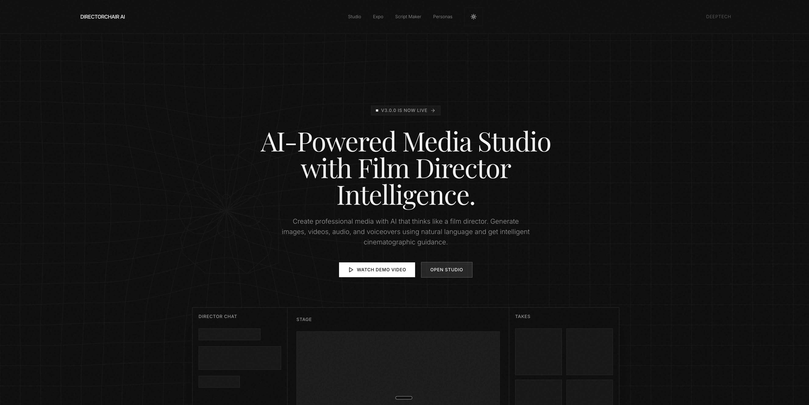

# 🎬 DIRECTORCHAIR AI

### Your AI-Powered Film & Media Studio

**Create cinematic images, videos, voiceovers, and full storyboards — all from a single conversation.**

---

---

## What Is DirectorChair AI?

DirectorChair AI is a **cinematic media studio** that puts the power of a full production team in your browser. Describe what you want in plain English — a scene, a character, a mood — and watch it come to life as images, videos, and audio, guided by AI that understands cinematography.

No timelines to learn. No rendering queues. No complex software. Just **you and your vision**.

---

## ✨ Why DirectorChair AI

| | Benefit |
|---|---|
| 🎥 **Director-Level Intelligence** | AI understands framing, lighting, camera angles, and cinematic language — not just keywords |
| ⚡ **Instant Results** | Go from idea to finished visual in seconds, not hours |
| 🔄 **Iterative Editing** | Refine any image or video with natural conversation — "make it moodier," "zoom in," "add rain" |
| 🎞️ **Full Production Pipeline** | Images → Video → Audio → Voiceover → Storyboard — all in one place |
| 🧠 **It Remembers Context** | Your creative session persists — pick up exactly where you left off |
| 📱 **Works Everywhere** | Fully responsive — create on desktop, tablet, or phone |

---

## 🎬 What You Can Create

### 🖼️ Stunning Images
Generate photorealistic scenes, concept art, product shots, and stylized illustrations from text descriptions. Upload reference images and edit them with natural language — change styles, swap elements, adjust lighting.

### 🎥 Cinematic Video
Turn any still image into smooth, high-quality video. Choose from multiple generation engines optimized for different styles — from fast previews to master-quality 1080p output with realistic motion.

### 🎙️ Professional Audio & Voice
Generate natural-sounding voiceovers, clone voices from samples, and sync lip movements to audio — perfect for trailers, presentations, and character dialogue.

### 📜 Smart Storyboards
Use the Script Maker to break down a full scene into shot-by-shot storyboards with AI-generated visuals for each frame. Go from screenplay to visual pitch deck in minutes.

---

## 🎨 The Studio Experience

### Three-Column Creative Workspace
- **Chat Panel** — Describe what you want in natural language. Drag & drop reference images directly into the conversation.
- **Canvas** — Your generated content appears here in real-time, auto-scrolling as new work is created.
- **Gallery** — Every piece you create is saved and organized. Fullscreen preview, download, edit, or animate with one click.

### Smart Controls
- **Model Selection** — Choose from 20+ AI models optimized for different tasks and styles
- **Aspect Ratio & Resolution** — Set output dimensions to match your project needs
- **Automatic Fallback** — If one model can't handle a request, the system seamlessly tries alternatives
- **Persistent Settings** — Your preferences are saved across sessions

---

## 🤖 Powered by 20+ AI Models

DirectorChair AI integrates the best-in-class models for every creative task:

- **Image Generation** — Google Imagen 4, Flux Pro Ultra, Stable Diffusion 3.5, Dreamina, and more
- **Image Editing** — Context-aware editing, style transfer, text manipulation, and precision controls
- **Video Generation** — Luma Ray 2, Kling v2.1 Master, Minimax Hailuo, Seedance, Wan Pro
- **Voice & Audio** — ElevenLabs TTS, MiniMax Speech HD, voice cloning, lip sync

You pick the model — or let DirectorChair choose the best one for your prompt.

---

## 🚀 How It Works

1. **Describe your vision** — Type what you want to create, or upload a reference image
2. **Generate** — AI creates your content in seconds
3. **Refine** — Edit with conversation: "make the sky darker," "add a person walking"
4. **Animate** — Turn any still into video with one click
5. **Export** — Download your finished work in high resolution

---

## 🌐 Try It Now

**DirectorChair AI is live at [directorchairai.com](https://directorchairai.com)**

---

**DIRECTORCHAIR AI** — Where AI meets cinematic creativity 🎬✨

*© 2025 DirectorChair AI. All rights reserved.*

